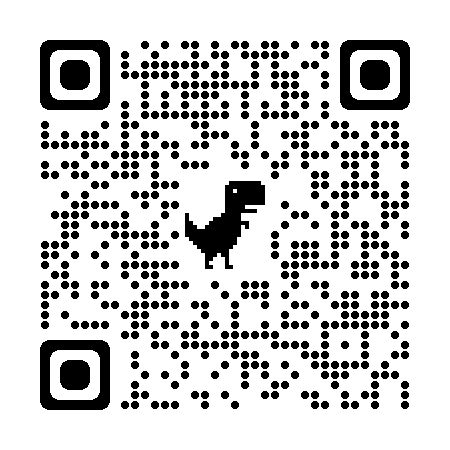

# swiper-cell

> 弹性滑动单元格

## Install

``` bash
import SwiperCell from "swiper-cell";
import "swiper-cell/lib/style.css";

```

##  Demo
- [Example](https://littaotao.github.io/swiper-cell/dist/index)
- 
  

### 使用方法
```html
<template>
    <div>
        <div class="swiperCell" v-for="(item, i) in arr" :key="i">
            <swiper-cell
                :quotient="item.quotient"
                @touchstart.native="touchstart(i)"
                @move="move($event, item)"
                @touchend.native="touchend"
                @close="close"
                :disabled="disabled"
                :type="item.type"
                :data="item"
                :leftContent="item.leftContent"
                :rightContent="item.rightContent"
                :isElastic="item.isElastic"
                :class="
                    (i === index && isTag && 'container_active') || 'container'
                "
                :key="i"
                @open="open($event, item)"
            >
                swiperCell-{{ i + 1 }}
            </swiper-cell>
        </div>
    </div>
</template>

<script>
import SwiperCell from "swiper-cell";
import "swiper-cell/lib/style.css";

export default {
    name: "HelloWorld",
    components: {
        SwiperCell,
    },
    data() {
        return {
            index: "",
            isTag: false,
            disabled: false,
            timer: null,
            position: "",
            arr: [
                {
                    leftContent: [],
                },
                {
                    rightContent: [
                        {
                            value: "删除",
                            callBack: (item, data) => {
                                console.log(item, data);
                            },
                        },
                    ],
                    quotient: [0, 1],
                },
                {
                    rightContent: [
                        {
                            value: "删除",
                            callBack: (item) => {
                                console.log(item);
                            },
                        },
                    ],
                },
                {
                    rightContent: [
                        {
                            value: "删除",
                            callBack: (item) => {
                                console.log(item);
                                item.value = "确认删除";
                            },
                        },
                    ],
                },
                {
                    type: 1,
                    isElastic: true,
                    rightContent: [{ value: "关注" }, { value: "收藏" }],
                },
                {
                    rightContent: [{ value: "关注" }, { value: "收藏" }],
                    type: 1,
                    isElastic: false,
                },
                {
                    type: 1,
                    isElastic: true,
                    leftContent: [{ value: "收藏" }],
                    quotient: [8, 8],
                },
                { type: 1, isElastic: true },
                { type: 1, isElastic: false },
                { type: 0, isElastic: true },
                { type: 0, isElastic: false },
            ],
        };
    },
    methods: {
        changeArr() {
            this.testArr[0] = Number((Math.random() * 100).toFixed(0));
        },
        open(e, item) {
            this.position = e.position;
            if (e.position === "left" && item.isElastic) {
                e.close();
            }
        },
        touchstart(i) {
            if (this.disabled && this.position === "left") {
                this.disabled && clearTimeout(this.timer);
                this.timer = null;
            }
            this.index = i;
        },
        touchend() {
            if (!this.timer && this.position === "left") {
                this.disabled = false;
            }
        },
        close() {
            if (this.position === "left") {
                this.disabled = true;
            }
            this.timer = setTimeout(() => {
                this.index = "";
                this.isTag = false;
                this.disabled = false;
            }, 300);
        },
        move(deltaX, item) {
            // 删除
            // console.log(item);
            if (item.rightContent && item.rightContent[0].value === "删除") {
                console.log("删除");
            }
            // 收藏、标记
            if (deltaX > 220 && item.isElastic) {
                if (!this.isTag) {
                    this.isTag = true;
                    console.log("收藏、标记");
                }
                return;
            }
            this.isTag = false;
        },
    },
};
</script>

<style lang="stylus" scoped>
.swiperCell {
    >>>.cell_container {
        height: 90px;
        line-height: 90px;

        .cell_content {
            background: #eee;
        }
    }

    border-bottom: 1px solid #EEE;
    overflow: hidden;

    &>.container_active {
        background: #E8B741;
    }
}
</style>


```

## Props


| 属性                           | 说明                    | 类型                                               |     默认值
| ------------------------------ | ----------------------- | ------------------------------------------------- | ---------------------
| name                           | 标识符，可以在事件参数中获取到  | number \| string                            |  auto
| before-close	                 | 关闭前的回调函数         | Function                                          | -
| disabled	                     | 是否禁用滑动	            | boolean                                           | false
| stop-propagation		         | 是否阻止滑动事件冒泡	     | boolean                                           | false
| leftContent	                 | 左侧内容（最多一个）      | array \| boolean                                  | [<br />&emsp;{value:"标记",icon:"fa fa-star-o"}<br />]
| rightContent	                 | 右侧内容（最多三个）      | array \| boolean                                  | [<br />&emsp;{value:"标为未读",icon:""},<br />&emsp;{value:"不显示",icon:""},<br />&emsp;{value:"删除",icon:""}<br />]
| quotient	                     | 左右两侧弹性系数	         | array                                             | [ 2.5, 8 ]
| type	                         | 类型(0 \| 1)              | number \| string                                 | 1
| isElastic	                     | 是否开启弹性	             | boolean                                           | true


## Slots

| 属性                                                            | 说明                   
| --------------------------------------------------------------- | ------------------------------------------------
| default                                                         | 自定义显示内容


## Events

| 事件名                          | 说明               | 回调参数    
| ------------------------------ | -----------------   |------
|click                           |点击时触发           | 关闭时的点击位置 (left right cell outside)
|open                            |打开时触发           | {position: 'left' \| 'right' ,name: string, close: Function}
|close                           |关闭时触发           | { position: string , name: string }
|move                            |移动时触发           | { deltaX: string }
